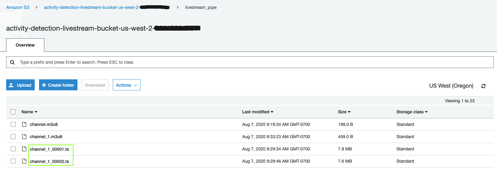
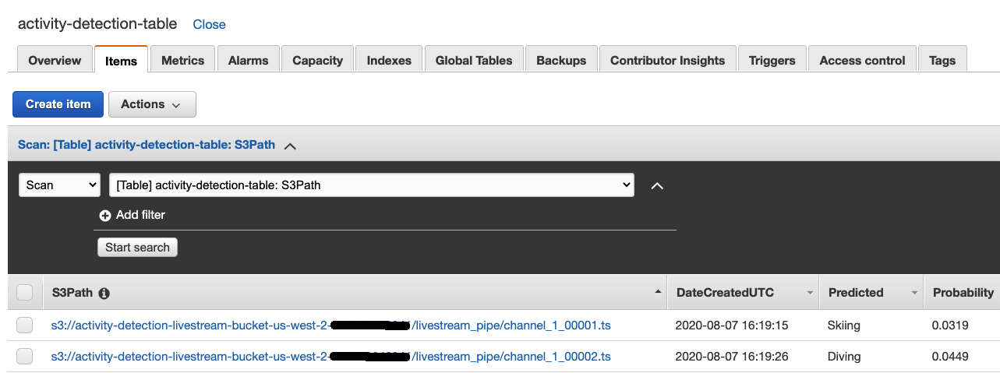

# Deploy an Activity Detection Solution using CloudFormation

This is an AWS-based Machine Learning solution to detect an activity in a video segment from a live stream. It is completely deployed using CloudFormation stacks from the given [yaml templates](./cloud_formation). The diagram below shows the AWS services used to implement it and the steps performed to detect an activity from a given video segment.


The AWS Elemental MediaLive livestreaming channel that is created from a sample video file in S3 bucket is used to demonstrate the real-time architecture. You can use other live streaming services as well that are capable of delivering live video segments to S3. The workflow is as follows:

1. AWS Elemental MediaLive sends live video with HTTP Live Streaming (HLS) and regularly generates fragments of equal length (10 seconds) as .ts files and an index file that contains references of the fragmented files as a .m3u8 file in a S3 bucket.

2. An upload of each video .ts fragment into the S3 bucket triggers a lambda function.

3. The lambda function simply invokes a SageMaker endpoint for activity detection with the S3 URI of the video fragment as the REST API payload input.

4. The SageMaker inference container reads the video from S3, preprocesses it, detects an activity and saves the prediction results to an Amazon DynamoDB table.

In this example, a sample [Skiing People](https://www.pexels.com/video/people-skiing-857074/) video is used to create the MediaLive livestream channel which is also included in the code repo [here](../videos/PeopleSkiing.mp4). In addition, the deployed model is the I3D model with Resnet50 backbone retrained with UCF101 dataset as explained in this [Jupyter Notebook](../development/SM-transferlearning-UCF101-Inference.ipynb). Autoscaling is enabled for the SageMaker endpoint in order to adjust the number of instances based on the actual workload.

If you want to use the solution with your own sample video and retrained model, please follow the instructions given in the next section.

##TODO: Add steps to use your own sample video and retrained model

## Prerequisites

1. Ensure that AWS CLI is installed. If not, please install by following [this](https://docs.aws.amazon.com/cli/latest/userguide/cli-chap-install.html).

2. Ensure you have your AWS CLI profile setup. If not, do as follows. To learn more about configuring AWS CLI, click [here](https://docs.aws.amazon.com/cli/latest/userguide/cli-chap-configure.html). In this example, the profile name is `detector` but feel free to use any name:


## Deploying the Solution

NOTE: There is a cost associated with the deployment and running of the solution. Please remember to delete all the AWS CloudFormation stacks when you are done with it to avoid additional charges. The steps to delete it is given in the next section. To estimate the cost associated with deploying and running it, please refer to the "cost estimation" section of this [blog post](#).

To deploy the solution, `launch.sh` shell script is used. It provides a step-by-step commands and instructions. Run the script and follow the given instructions. All the AWS services are created by using [CloudFormation Stacks](https://console.aws.amazon.com/cloudformation/). After the stacks are created, please make sure they are created successfully by going to the [CloudFormation Console](https://console.aws.amazon.com/cloudformation/). Note that, at the beginning, it will ask you to provide the profile name. Provide the profile name you created in the previous section. It will take 15-20 minutes to deploy the architecture.

Note: If the solution is created in `us-east-1`, please replace the `s3-${AWS::Region}` with `s3` in the each TemplateURL of the activity detection [template](./cloud_formation/cfn_activity_detection.yaml).

Before running `launch.sh`, ensure that it is executable. Run the following commands:

```bash
chmod +x launch.sh
./launch.sh
```


Once you successfully run the `launch.sh`, you will be able to create all the AWS resources used in the solution. When you go to your [CloudFormation Console](https://console.aws.amazon.com/cloudformation/), you will see all the stacks that are successfully created. You should get similar to the one shown below:


If you get all the stacks created with status `CREATE_COMPLETE`, CONGRATULATIONS!! You have successfully deployed the end-to-end solution.

Once the solution is successfully deployed, the following AWS resources are created:

* S3 Bucket (default name: `activity-detection-data-bucket-<aws-region>-<account-id>`)- stores the CloudFormation templates, sample video and model artifacts.
* S3 Bucket (default name: `activity-detection-livestream-bucket-<aws-region>-<account-id>`)- stores video segments from the live video stream.
* MediaLive Channel (default name: `activity-detection-channel`)- creates video segments from the live video stream and saves them to the S3 bucket.
* ambda Function (default name: `activity-detection-lambda`) - Invokes the SageMaker endpoint to detect activities from each video segment.
* SageMaker Endpoint (default name: `activity-detection-endpoint`) - Loads a video segment, detects an activity and saves the results into a DynamoDB table.
* DynamoDB Table (default name: `activity-detection-table`) - Stores the prediction results from the endpoint.

Please note that some other supporting resources, like IAM roles, are also created to provide permissions to their respective resources.

## Using the Solution

After the solution is deployed, it is time to run it and see its outputs.

1. First go to the [AWS Elemental Medialive Console](https://console.aws.amazon.com/medialive/) and start the channel for live-streaming as shown below. Please wait for the channel state to change to `Running`.


2. Once the channel state is changed to `Running`, ts-formatted video segments will be saved into the the livestream [S3 bucket](https://console.aws.amazon.com/s3/) as shown below. Please note that only the latest 21 video segments are kept in the S3 bucket to save storage. However, if you want to increase the number of segments to be stored, you can go to the [MediaLive template](./cloud_formation/cfn_medialive.yaml) and change the `keepsegments` key before you deploy the solution.



3. Each ts-formatted video upload will trigger a lambda function. The lambda function invokes a SageMaker endpoint for activity detection with the S3 pointer as a payload input. The deployed model predicts the activity and saves the results into a [DynamoDB table](https://console.aws.amazon.com/dynamodb/) as shown below:



## Deleting the Solution

If you no longer need the solution, it can be deleted by running `cleanup.sh` script. Before you start running the script, please stop the AWS Elemental MediaLive channel by going to the [MediaLive Console](https://console.aws.amazon.com/medialive/). Once you start it, please follow the instructions. Run the commands below to start cleaning up the AWS services used in the solution:

```bash
chmod +x cleanup.sh
./cleanup.sh
```


Once you ran the script successfully, please go to your [CloudFormation Console](https://console.aws.amazon.com/cloudformation/) and make sure that all the stacks are deleted properly. If so, CONGRATULATIONS!! You have successfully deleted all the AWS resources associated with the solution.

